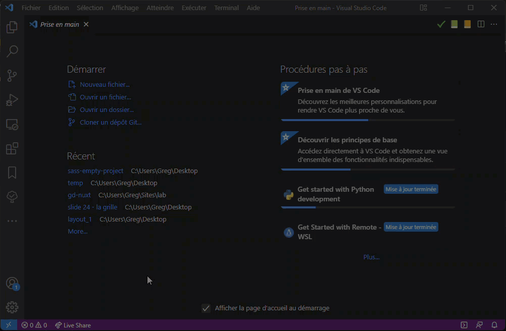

# Création d'un projet vide pour utiliser sass

- Cloner le dépot :
  - Soit en utilisant ```git clone  https://github.com/GregDesplaces/sass-empty-project.git```
  - Soit en utilisant vscode (voir animation ci-dessous)
- Installer les dépendances avec ```npm install```
- Lancer la transpilation avec ```npm run dev```

### Utiliser vscode pour cloner le dépot



